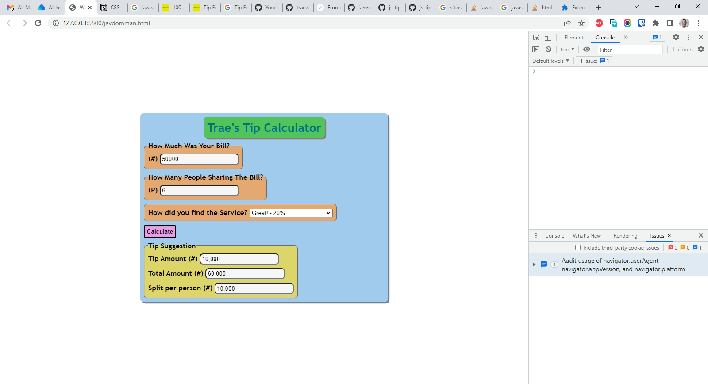

# jsbeginners.com - Tip Calculator solution

This is a solution to the [Tip Form JavaScript Project on JS Beginners](https://jsbeginners.com/tip-form-javascript-project/). I am trying to improve my coding skills by building realistic projects. 

## Table of contents

- [Overview](#overview)
  - [The challenge](#the-challenge)
  - [Screenshot](#screenshot)
  - [Links](#links)
- [My process](#my-process)
  - [Built with](#built-with)
  - [What I learned](#what-i-learned)
  - [Continued development](#continued-development)
  - [Useful resources](#useful-resources)
- [Author](#author)
- [Acknowledgments](#acknowledgments)

## Overview

### The challenge

Users should be able to:

- You should be able to use the calculator to enter an amount of a bill, the number of people who will split the bill, and a selection as to how the service went.  
- When you click the calculate button, the cost implications should be displayed.  

### Screenshot

### Links

- Solution URL: [https://github.com/traez/tip-calculator](https://github.com/traez/tip-calculator)
- Live Site URL: [https://traez.github.io/tip-calculator/](https://traez.github.io/tip-calculator)

## My process

### Built with

- Semantic HTML5 markup
- CSS custom properties
- Flexbox
- CSS Grid
- JavaScript

### What I learned

1) DOM manipulation learning never ends. O ti poju! Learnings plenty...too much to mention. 

### Continued development

1) This was my first real respectable JavaScript project done with no cloning. Proud of myself much but need to keep advancing faster. 

### Useful resources

Stackoverflow, MDN Web Docs, w3schools, YouTube, Google 

## Author

- Website - [Trae Zeeofor](https://github.com/traez)  
- Twitter - [@trae_z](https://twitter.com/trae_z) 

## Acknowledgments

Me, myself and I. Thank you.  
